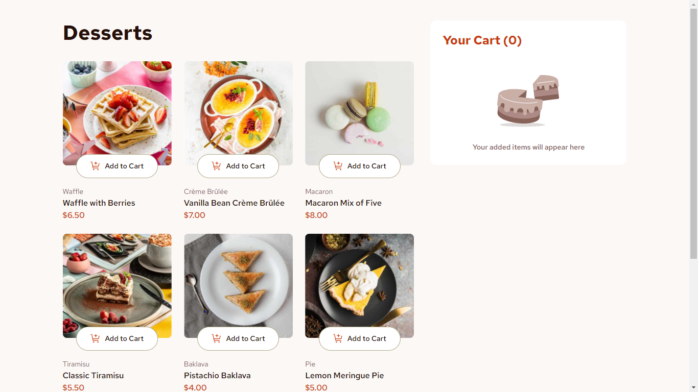

# Frontend Mentor - Product list with cart solution

This is a solution to the [Product list with cart challenge on Frontend Mentor](https://www.frontendmentor.io/challenges/product-list-with-cart-5MmqLVAp_d). Frontend Mentor challenges help you improve your coding skills by building realistic projects. 

## Table of contents

- [Overview](#overview)
  - [The challenge](#the-challenge)
  - [Screenshot](#screenshot)
  - [Links](#links)
- [My process](#my-process)
  - [Built with](#built-with)
  - [What I learned](#what-i-learned)
  - [Useful resources](#useful-resources)
- [Author](#author)

## Overview

### The challenge

Users should be able to:

- Add items to the cart and remove them
- Increase/decrease the number of items in the cart
- See an order confirmation modal when they click "Confirm Order"
- Reset their selections when they click "Start New Order"
- View the optimal layout for the interface depending on their device's screen size
- See hover and focus states for all interactive elements on the page

### Screenshot



### Links

- Live Site URL : [Live Site]()
- Solution URL : [Code Solution](https://github.com/LamineGitHub/desserts-app)

## My process

### Built with

- Semantic HTML5 markup
- CSS custom properties
- Flexbox
- CSS Grid
- Mobile-first workflow
- [React](https://react.dev/) - JS library
- [Tailwindcss](https://tailwindcss.com/) - For styles

### What I learned

During the development of the **Desserts app**, I had the opportunity to dive deeper into state management and UI handling, particularly in the following areas:

1. Modal Management with External Hooks
  I integrated an external library for handling modals, which allowed for a cleaner and more efficient approach. Using custom hooks from this library, I was able to manage the opening and closing of modals in a more declarative and reusable way. This approach significantly improved the maintainability of the codebase, especially for handling the order confirmation process.
  
  ```ts
// src/components/modal.tsx  

export function Modal({ closeModal, totalOrder, dessertCart }: Props) {
  const [isVisible, setIsVisible] = useState(false);
  const modalRef = useRef<HTMLDivElement>(null);
  
  useScrollLock();
  useOnClickOutside(modalRef, () => handleClose());

//...
}
  ```

2. State Management with Zustand: 
   Zustand proved to be an excellent choice for managing the state of the shopping cart. Its simplicity allowed me to handle cart operations, like adding or removing items, with minimal boilerplate. 
   Zustand’s store-based architecture also made it easy to share state across components without the complexity of larger state management solutions.

  ```ts
// src/store/useDessertsStroe.ts

const useDessertsStoreBase = create<DessertState>()(
  persist(
    (set) => ({
      desserts: dessertsData,

      increment: (id: number) =>
        set((state) => ({ desserts: incrementDessert(state.desserts, id) })),

      decrement: (id: number) =>
        set((state) => ({ desserts: decrementDessert(state.desserts, id) })),

      remove: (id: number) =>
        set((state) => ({ desserts: removeDessert(state.desserts, id) })),

      resetCart: () =>
        set((state) => ({ desserts: resetDesserts(state.desserts) })),
    }),
    { name: 'cart-storage' }
  )
);
  ```

These learnings not only improved my understanding of handling complex UI flows but also reinforced the importance of choosing the right tools for specific use cases.
### Useful resources

- [usehooks-ts Documentation](https://usehooks-ts.com) - This library provided me with a collection of reusable hooks, which simplified my code and made managing state and UI interactions much easier. I specifically used it for managing modal states efficiently and will definitely rely on it in future projects.

- [Zustand Documentation](https://docs.pmnd.rs/zustand/getting-started/introduction) - Zustand was a lightweight yet powerful state management tool for this project. It allowed me to manage the cart's state with minimal boilerplate and a clean API. I highly recommend it for anyone looking for a simple but effective state management solution.


## Author

- LinkedIn - [Lamine Diallo](https://www.linkedin.com/in/mamadou-lamine-diallo-1a8596241)
- Frontend Mentor - [@lamine](https://www.frontendmentor.io/profile/LamineGitHub)
